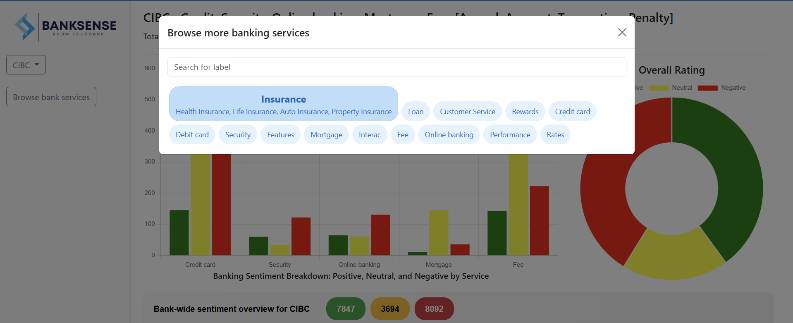

# Bank Review Sentiment Analysis and Service Search Platform

## Overview
This project is a Natural Language Processing (NLP) and Text Mining platform designed to analyze customer reviews for various banks. Using a machine learning model, the platform extracts sentiments (positive, negative, neutral) from these reviews. Additionally, users can search for banks and specific services to get a sentiment-based summary of how customers feel about those services, represented visually through charts and diagrams.

## Features
- **Bank Reviews Sentiment Analysis**: Analyze customer reviews and extract sentiment using an NLP-based machine learning model.
- **Service Search**: Search for banks and their services to view customer sentiment and ratings.
- **Visualization**: Interactive charts and diagrams displaying sentiment distribution, ratings, and service feedback.
- **Machine Learning Model**: Uses a pre-trained machine learning model for sentiment analysis on textual data.
- **Bank & Service Directory**: Allows users to search for specific services offered by different banks.

## Technologies Used
- **Natural Language Processing (NLP)**: For text analysis and sentiment extraction.
- **Machine Learning**: Classification models for sentiment analysis.
- **Web Framework**: Django
- **Data Visualization**: Charts and diagrams using libraries like Matplotlib, and chartJS.
- **Backend**: Python
- **Frontend**: HTML, CSS, JavaScript, Bootstrap

## Screenshot





## Installation

### Prerequisites
Make sure you have the following installed:
- Python 3.x
- pip (Python package manager)
- Django
  
### Steps

1. **Clone the repository**:
    ```bash
    git clone https://github.com/your-username/your-repository-name.git
    cd your-repository-name
    ```

2. **Create a virtual environment**:
    ```bash
    python -m venv env
    source env/bin/activate  # On Windows use `env\Scripts\activate`
    ```

3. **Install dependencies**:
    ```bash
    pip install -r requirements.txt
    ```

4. **Set up the database** (if applicable):
    ```bash
    python manage.py migrate  
    ```

5. **Run the application**:
    ```bash
    python manage.py runserver  # Adjust based on your framework
    ```

6. **Access the application**: 
   Open your browser and go to `http://127.0.0.1:8000/`.

## Usage
1. **Search for a bank**: Use the search bar to look for a specific bank and service.
2. **View sentiment analysis**: The platform will display a sentiment analysis for the selected service.
3. **Explore visualizations**: Interactive charts show detailed breakdowns of customer feedback.

## Data Flow
1. **Data Collection**: The platform collects customer reviews for banks from various sources (e.g., online forums, social media, or internal databases).
2. **Text Preprocessing**: Raw text is cleaned, tokenized, and prepared for the machine learning model.
3. **Sentiment Analysis**: The machine learning model analyzes the sentiment of each review (positive, negative, neutral).
4. **Search**: Users can search for banks and services, and the corresponding sentiment is displayed.
5. **Visualization**: Sentiment results are presented visually through charts and graphs for easy understanding.

## Machine Learning Model
- The model is trained on a labelled dataset of bank reviews.
- It uses Naive Bayes, and BERT for classifying reviews into sentiment categories.
  
### Feature Extraction: TF-IDF
We use **TF-IDF (Term Frequency-Inverse Document Frequency)** as a feature extraction technique to convert textual data into numerical form for the machine learning model. 

## Visualizations
- **Sentiment Distribution**: Pie charts or bar graphs showing the proportion of positive, negative, and neutral reviews.
- **Service-Specific Feedback**: Line charts or histograms tracking sentiment over time for particular services.
- **Overall Bank Performance**: Comparative charts for different banks, based on customer reviews and ratings.

## Contributing
Contributions are welcome! Please follow these steps:
1. Fork the repository.
2. Create a new branch (`git checkout -b feature/your-feature`).
3. Make your changes.
4. Commit your changes (`git commit -m 'Add some feature'`).
5. Push to the branch (`git push origin feature/your-feature`).
6. Open a pull request.
